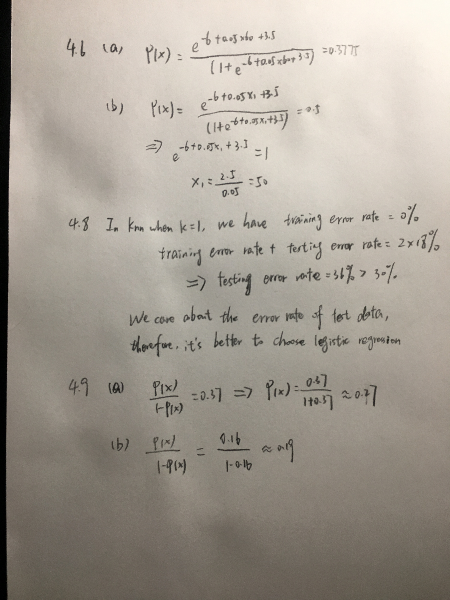

```{r setup, include=FALSE}
knitr::opts_chunk$set(echo = TRUE)
```
#4.6 & 4.8 &4.9 in the next page graph!

#4.10 (a)
```{r}
library(ISLR)
summary(Weekly)
# According to the summary, all the lags and today have the same min and max value.
```
#(b)
```{r}

mod1<-glm(Direction ~ Lag1 + Lag2 + Lag3 + Lag4 + Lag5 + Volume, data = Weekly, family = binomial)
summary(mod1)
# From the model summary, we can see that only the intercept and Lag2 are significant.
```
#(c)
```{r}
library(caret)
pred<-predict(mod1, type = "response")
updown <- rep("Down", length(pred))
updown[pred > 0.5] <- "Up"
table(updown, Weekly$Direction)
# According to the confusion matrix, the accuracy of down is 54/(54+430)
# the accuary of up is 557/(48+557)
```

#(d)
```{r}
library(dplyr)
train <- Weekly%>% filter(Year < 2009)
Weekly.20092010 <- Weekly[!train, ]
mod2 <- glm(Direction ~ Lag2, data = train, family = binomial)
summary(mod2)
pred2<-predict(mod2, Weekly.20092010,type = "response")
updown <- rep("Down", length(pred2))
updown[pred2 > 0.5] <- "Up"
table(updown, Weekly.20092010$Direction)

```
#(e)
```{r, warning=FALSE}
library(MASS)
train <- Weekly%>% filter(Year < 2009)
Weekly.20092010 <- Weekly[!train, ]
mod3 <- lda(Direction ~ Lag2, data = train, family = binomial)
mod3
pred3<-predict(mod3, Weekly.20092010)
table(pred3$class, Weekly.20092010$Direction)

```

#(f)
```{r, warning=FALSE}
library(MASS)
train <- Weekly%>% filter(Year < 2009)
Weekly.20092010 <- Weekly[!train, ]
mod3 <- qda(Direction ~ Lag2, data = train, family = binomial)
mod3
pred3<-predict(mod3, Weekly.20092010)
table(pred3$class, Weekly.20092010$Direction)

```
#(g)
```{r, warning=FALSE,error=FALSE}
library(class)
train.X <- na.omit(as.matrix(Weekly%>% filter(Year < 2009)))
test.X <- na.omit(as.matrix(Weekly%>% filter(Year >= 2009)))
train<-Weekly%>% filter(Year < 2009)
train.Direction <-na.omit(train$Direction)
set.seed(1)
###pred.knn <- knn(train.X, test.X, train.Direction, k = 1)
###table(pred.knn, Weekly.20092010$Direction)

```


#4.11 (a)
```{r}
data(Auto)
mpg<-Auto$mpg
mpg
mpg01 <- rep(0, length(mpg))
mpg01[mpg > median(mpg)] <- 1
mpg01<-data.frame(Auto,mpg01)
mpg01
```
#(b)
```{r}
par(mfrow=c(2,3))
name=c("cylinders","displacement","horsepower","weight","acceleration")

boxplot(cylinders ~ mpg01, data = mpg01, main = "cylinders vs mpg01")
boxplot(displacement ~ mpg01, data = mpg01, main = "displacement vs mpg01")
boxplot(horsepower~ mpg01, data = mpg01, main = "horsepower vs mpg01")
boxplot(weight ~ mpg01, data = mpg01, main = "weight vs mpg01")
boxplot(acceleration ~ mpg01, data = mpg01, main = "acceleration vs mpg01")

```
#(c)
```{r}
set.seed(1)
rows <- sample(x=nrow(mpg01), size=0.8*nrow(mpg01))
rows
trainset <- mpg01[rows, ]
testset <- mpg01[-rows, ]

```
#(d)
```{r}
lda.fit <- lda(mpg01 ~ displacement+horsepower+weight+acceleration+year+cylinders+origin, data=trainset)
lda.pred <- predict(lda.fit, testset)
table(testset$mpg01, lda.pred$class)
# accuracy of 0=100%, accuracy of 1=44/(44+5)
```
#(e)
```{r}
qda.fit <- qda(mpg01 ~ displacement+horsepower+weight+acceleration+year+cylinders+origin, data=trainset)
qda.pred <- predict(qda.fit, testset)
table(testset$mpg01, qda.pred$class)
# accuracy of 0=32/(32+2), accuracy of 1=42/(3+42)

```
#(f)
```{r}
modf <- glm(as.factor(mpg01) ~ displacement+horsepower+weight+acceleration+year+cylinders+origin, data=trainset, family="binomial")
lr.probs <- predict(modf , testset, type="response")
lr.pred <- ifelse(lr.probs>0.5, "1", "0")
table(testset$mpg01, lr.pred)
# accuracy of 0=30/(30+1), accuracy of 1=43/(5+43)
```
#(g)
```{r}

```

#4.12 (a)
```{r}
Power <- function(){ print( 2^3)}
Power()
```
#(b)
```{r}

Power2 <- function(x,a){
  print( x^a)
}

Power2(3,8)
```
#(c)
```{r}
Power2(10,3)
Power2(8,17)
Power2(131,3)

```
#(d)
```{r}
Power3 <- function(x,a){
  return( x^a)
}

```
#(f)
```{r}
plot(x = x<-1:10, y= y<-Power3(x,2), xlab="x", ylab="x²")
plot(x,y,log="xy", xlab="log(x) scale", ylab="log(x²) scale")

```
#(g)
```{r}
PlotPower <- function(x,a){
  plot(x = x, y= y<-Power3(x,a), xlab="x", ylab=paste0("x^",a))
}

PlotPower(1:10,3)

```
