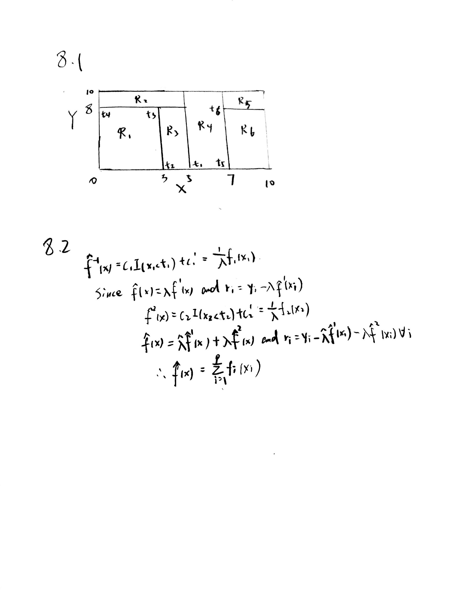

# 8.1 and 8.2 are in the next page


#8.3
```{r}
temp <- seq(0, 1, 0.01)
gini.index <- 2 * temp * (1 - temp)
class.error <- 1 - pmax(temp, 1 - temp)
cross.entrotempy <- - (temp * log(temp) + (1 - temp) * log(1 - temp))
matplot(temp, cbind(gini.index, class.error, cross.entrotempy), col = c("blue", "red", "purple"))
```

#8.5
```{r}
#1. We classify X as Red as it is the most commonly occurring class among the 10 predictions (6 for Red vs 4 for Green)
#2. With the average probability approach, we classify X as Green as the average of the 10 probabilities is 0.45.
```

#8.7
```{r}
library(MASS)
library(randomForest)
set.seed(2)
train <- sample(1:nrow(Boston), nrow(Boston) / 2)
Boston.train <- Boston[train, -14]
Boston.test <- Boston[-train, -14]
Y.train <- Boston[train, 14]
Y.test <- Boston[-train, 14]
rf.boston1 <- randomForest(Boston.train, y = Y.train, xtest = Boston.test, ytest = Y.test, mtry = ncol(Boston) - 1, ntree = 500)
rf.boston2 <- randomForest(Boston.train, y = Y.train, xtest = Boston.test, ytest = Y.test, mtry = (ncol(Boston) - 1) / 2, ntree = 500)
rf.boston3 <- randomForest(Boston.train, y = Y.train, xtest = Boston.test, ytest = Y.test, mtry = sqrt(ncol(Boston) - 1), ntree = 500)
plot(1:500, rf.boston1$test$mse, col = "green", type = "l", xlab = "Number of Trees", ylab = "Test MSE", ylim = c(10, 19))
lines(1:500, rf.boston2$test$mse, col = "red", type = "l")
lines(1:500, rf.boston3$test$mse, col = "blue", type = "l")
legend("topright", c("m = p", "m = p/2", "m = sqrt(p)"), col = c("green", "red", "blue"), cex = 1, lty = 1)

```

